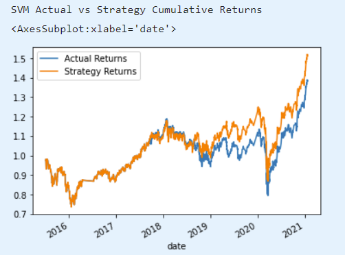
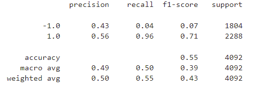
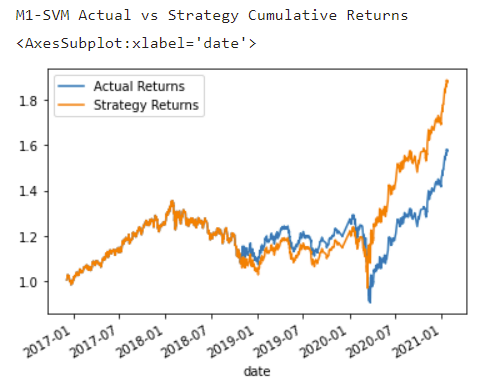
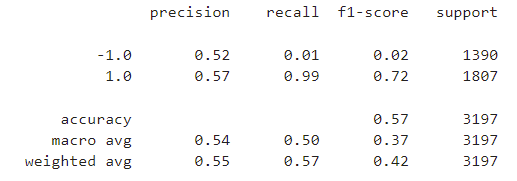
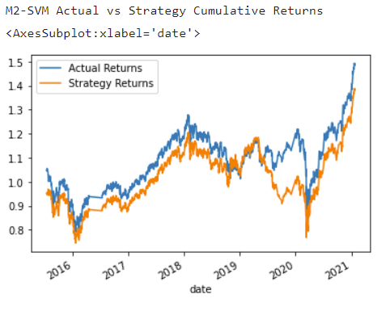
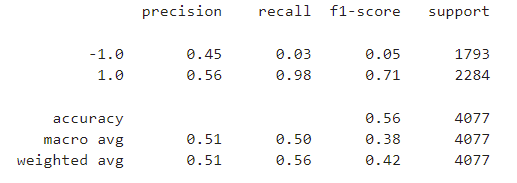
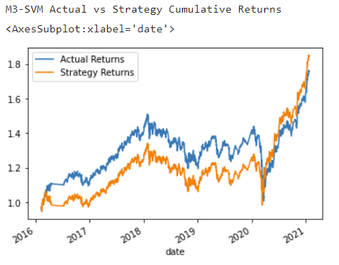
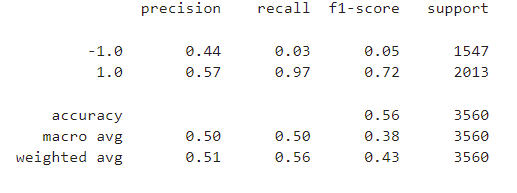
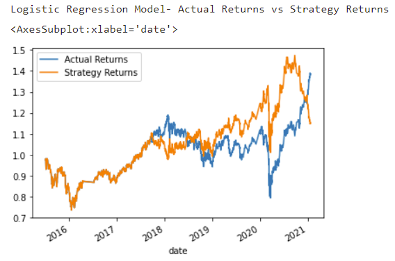
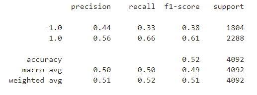

# **Machine Learning Algorithmic Trading**
The algorithm trading app is a python jupyter lab interface program. It uses various machine learning models and techniques to train and evaluate, and himprove the existing algorithmic trading systems and maintain the firm’s competitive advantage in the market. This app enhances the existing trading signals with machine learning algorithms that can adapt to new data.

This Python ML Algo Trading Bot application is set up in 4 sections. They are:

Establish Baseline Performance

Tune Baseline Trading Algorithm

Evaluate New Machine Learning classifier

Create Evaluation Report

---
## Technologies
This application is developed on the *Python 3.7.11 version* 

* [Jupyter Notebook](https://jupyter-notebook-beginner-guide.readthedocs.io/en/latest/what_is_jupyter.html) - It's a server-client application that allows editing and running notebook documents via a web browser.

* [pandas](https://pandas.pydata.org/pandas-docs/stable/index.html) - For Series, DataFrame, and plots

* [numpy](https://numpy.org/) - For adding support for large, multi-dimensional arrays and matrices, along with a large collection of high-level mathematical functions to operate on these arrays

* [pathlib](https://docs.python.org/3/library/pathlib.html) -For object-oriented filesystem paths 

* [%matplotlib inline](https://pythonguides.com/what-is-matplotlib-inline/#:~:text=What%20is%20matplotlib%20inline%20in%20python%20IPython%20provides,two%20types%20of%20magic%20functions%2C%20line-oriented%20and%20cell-oriented.) - For Cell-oriented magic functions

* [sklearn](https://scikit-learn.org/stable/index.html) - For Simple and efficient tools for predictive data analysis.

---
## Installation Guide
The following installation must be performed before running the program:

*Install Jupyter Lab*

*Install -U scikit-learn*

*Install pandas*

---
## Usage
To run this application, create a clone on the local desktop. Then, initiate your conda environment and launch in Jupyter Lab.

1. Base Support Vector Machine Model:  The base model has 55% accruacy prediction.  The recall of signal -1 is only 4%.  It means that of total actuals as signal -1, the model only predicts 4% accurately. For signal 1, the precision, recall, f1-score are good.  The strategy cumulative returns outperforms the actual cumulative returns.

2. Support Vector Machine Model 1 - The model with increaseing training window to 20-month has accuracy rate higher than original model by 2%.  However, the signal -1 recall drops in new model.  For signal 1, F1-score, recall, precision rates are better than the base model.  The cumulative return performs better in base model and actual returns.

3. Support Vector Machine model 2 - The model with change of short window to 30 and long window to 120 has accuracy rate higher than original model by 1%. While the singal 1 recall rate increases a little, the singal -1 recall rated drops slightly as well.  The model 2 cumulative return is lower than the actual cumulative return and is also lower than the original model cumulative return even though the model 2 accuracy rate is higher than base model.

4. Support Vector Machine model 3 - The model with change of training windows as 10-month, short window to 3 and long window to 120 has accuracy rate higher than original model by 1%. While the singal 1 recall rate increases a little, the singal -1 recall rated drops slightly as well.  The model 3 cumulative return is lower than the actual cumulative return even though the model 3 accuracy rate is higher than base model.

5. Logistic Regression model - The accuracy rate is lower than the base model.  This model has highest the recall rates/precision/f1-score for signal -1.  Cumulative strategy returns is the lower than the actual cumulative returns and lowest among all of the models.

In summary, the best model is the original LogisticRegression "new_model" with the DateOffset at 3 months and the short window / long window set to 4 day and 100 days, respectively. The precision is about the same; but the recall of 0.33 for -1 class and 0.66 for the 1 class shows better performance in comparison to the other models.

---
## Contributors
*Contributors*: Saina Azimi

*Email*: azimi.sainaa@gmail.com

*LinkedIn*: https://www.linkedin.com/in/azimi-saina/ 

---
## License 
UC Berkeley

----